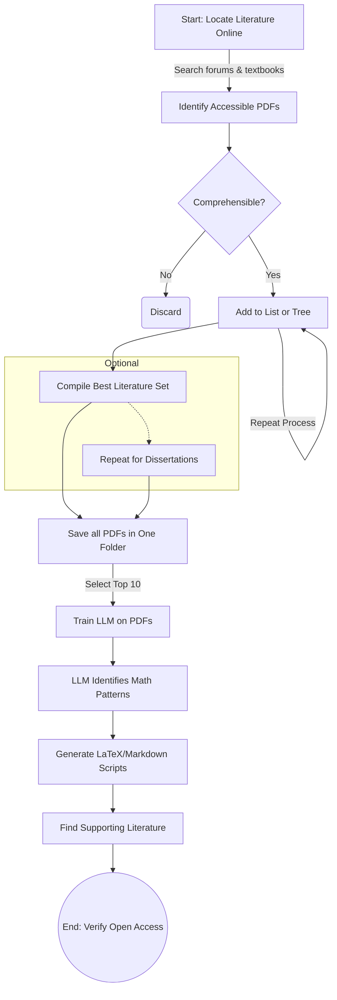

# Math-and-Physics-How-To
A repository of publicly-accessible resources for learning & self-teaching mathematics & physics up to the graduate level.

*Scroll to the bottom of the page to see Onri's Table of Critical Equations*

"Being good or great at mathematics is a matter of practice. Isolating a term in a complex mathematical formula is like untangling a knot, it requires persistence & loosening of things". - O.J.B.

---

Physics <-- Greek phýsis (“nature”) --> “study of what nature does.”

Parameter <-- Greek para (“beside”) + metron (“measure”) --> “a measurable beside the main variables.”

Stimulus <-- Latin stimulus (“goad, spur”). Response <-- Latin respondēre (“answer”).

--- 

### Free Mathematics Textbooks Resources: 
- [Mathematics Its Contents Methods And Meaning Vol 1, 2, & 3](https://archive.org/details/MathematicsItsContentsMethodsAndMeaningVol3/Mathematics-%20its%20contents%20methods%20and%20meaning%20Vol%201/page/n221/mode/2up)
- [Mathematical Handbook - Higher Mathematics](https://archive.org/details/vygodsky-mathematical-handbook-higher-mathematics-mir/mode/2up)
- [Abel’s Theorem in Problems and Solutions](https://www.maths.ed.ac.uk/~v1ranick/papers/abel.pdf)
- [Elementary Topology](https://www.math.kth.se/math/GRU/2008.2009/SF2721/olegviro.pdf)
- [Ordinary Differential Equations](https://cosmathclub.wordpress.com/wp-content/uploads/2014/10/morris-tenenbaum-harry-pollard-ordinary-differential-equations-copy.pdf)
- [Mathematics Library on Internet Archive](https://archive.org/search?query=publisher%3A%22Mir+Publishers%22&and[]=subject%3A%22mathematics%22)
- [Quantum Mechanics, 3 Volumes](https://archive.org/details/cohen-tannoudji-diu-and-laloe-quantum-mechanics-vol.-i-ii-and-iii-2nd-ed./mode/2up)
- [How to Learn Math and Physics](https://math.ucr.edu/home/baez/books.html)

---

### In Case You Want Some Fun Open Access Interactive Tools to Try:
- [Free Education](https://ojb-quantum.github.io/Free-Education)

--- 

### Great Resources for Practicing Computational Methods:
- [J Robert Johansson's Website on Scientific Computing & QuTiP](https://jrjohansson.github.io/computing.html)
- [QuTiP Tutorials](https://qutip.org/qutip-tutorials)
- [Open a New Google Colab Notebook](https://colab.research.google.com)
- [Browse Some Fun Data Science Notebooks in Google Colab](https://colab.google/notebooks/#data)

--- 

### Map of Mathematics & Their Prerequisites:


Borrowed from: *Learn with the Map of Mathematics*, The Bright Side of Mathematics (2023)  
<https://youtu.be/ljGSId-uHw8?si=xKNup3hOVsWC6uTv&t=200>

--- 

### Strategic Approach to Solving Mathematical, Physical, & Engineering Problems Manually by (O.J.B.):  


---

### A Technique For Training a Large Language Model Strategically on Real Mathematics Resources by (O.J.B.)




---

### Pro Tips for Solving Mathematical Problems by (O.J.B.):

| **Tip** | **Explanation/ Details** |
|-|-|
| Substitute given variables with custom <br> or other existing variables (e.g., AbcdEfG) | Solve the equation using your own variables, then mirror the steps onto the original problem for proportional reasoning. A technique to solving a formula is to find a term that exists in a different equation, followed by solving for that desired term (isolating it to one side). |
| Interpret the equal sign as <br> "converts to" | Thinking of "=" as "converts to" can facilitate substitutions & <br> manipulations in other mathematical expressions. |
| Think in terms of ratios by <br> default | Viewing values as ratios can simplify problem-solving &  conceptual understanding. |
| Understand the difference between analytical vs. numerical approaches| Exact solutions are often associated with analytical approaches while approximation or discretized solutions are often associated with numerical appoaches. | 
| Isolating a term in a complex mathematical formula is like untangling a knot | Sometimes one needs to loosen things before making real progress, and every move must be made with careful consideration of how it affects the whole structure. Being well-organized & systematic can take one a very long way in problem solving. |
| Use software tools for conversion <br> to markdown or LaTeX | Convert equations for better inspection & rendering, ensuring <br> accuracy. |
| Leverage Python & libraries <br> like SymPy | Write equations in Python for execution & manipulation, aiding clarity & verification. |
| Remember solutions on graphs <br> are line intersections | Graphical solutions typically correspond to intersection points of lines or curves. |
| It is safe to assume invisible exponents of 1 as well as invisible grouping symbols | Keeping this in mind helps to maintain organization for obtaining a correct result. <br> It also helps with being able to linearize the writing format for code and things like LaTeX. |
| It is useful to think of formulas as having grouped components within invisible grouping symbols | In such a case, a grouped component may likely be acting like a modulator or scaling factor. |
| Use preferred mathematical <br> notations | Include curly brackets, e-notation, prime/dot notation, & highlight invisible symbols for clarity & precision. |
| Stay aware of term replacements | Recognize when terms are replaced or approximated in mathematical contexts. Keywords: replacement, approximation. |
| Consider various methods <br> (axiomatic, first principles, <br> empirical) | Use diverse approaches, including logical derivations, empirical evidence, & hybrid methodologies for problem-solving. |
| Explore graphical, tabulated, or <br> geometric representations | Visual or tabular methods can simplify complex mathematical concepts. |
| Practice final exam reviews | Mastery in mathematics comes with regular & extensive practice, particularly of exam-style problems. |

---

### Table of Useful General Assumptions for Abstract Terminology Used in Everyday Life:

| **Term or Concept** | **Description or Note** |
|-|-|
| **Another way of saying abstract** | “Indeterminate” or “boundless". |
| **Light** | Generally refers to the electromagnetic field or electromagnetic radiation. When quantized, it usually refers to photons but can also mean quantized modes, coherent and squeezed states, polaritons, or plasmons and surface plasmon polaritons. |
| **Optics** | A branch of physics concerned with the generation, propagation, manipulation, and detection of electromagnetic radiation (especially in and around the visible range), as well as its interactions with matter, including phenomena like reflection, refraction, diffraction, interference, and polarization. There are sub-disciplines or sub-classifications of optics such as electron, ion, and quantum optics. |
| **Plastic** | Often used metaphorically to refer to something moldable or flexible; in a physical context, it can mean a polymer material or exhibit plastic (irreversible) deformation. |
| **Radiation** | The emission or transmission of energy through space or a medium in the form of electromagnetic waves (e.g., radio waves, visible light, X-rays, gamma rays) or subatomic particles (e.g., alpha, beta, neutrons). In a broader sense, it can also refer to acoustic waves, though in physics “radiation” typically implies electromagnetic or particle radiation. Many people equate “radiation” solely with ionizing radiation, which is harmful in large doses and includes X-rays, gamma rays, and high-energy particles that can ionize atoms. This is a common misunderstanding because non-ionizing radiation (like visible light, microwaves, radio waves) is also “radiation,” just not ionizing. |
| **Electric field** | Generally refers to the force per unit charge in a region due to a static or dynamic charge distribution. It can also be generated or excited by time-varying magnetic fields (as in electromagnetic waves) or by charge redistribution effects caused by incident radiation (e.g., in the photoelectric effect). Note: In formal treatments, the photoelectric effect is more often framed in a quantum context rather than purely classical terms. |
| **Pure electric fields can be justified as being “pure”** | If they originate from idealized situations: a point charge, a parallel plate capacitor, uniformly charged conductors, electrostatic lenses (vacuum tube-based focusing), and electric dipole fields. |
| **Space** | A boundless, continuous, or discrete extent in which objects, fields, or systems exist, interact, and have relative positions. In STEM, it can refer to **physical space** (three-dimensional Euclidean or non-Euclidean structures), **mathematical spaces** (vector spaces, phase spaces, Hilbert spaces, and even two-dimensional planes such as Cartesian planes or complex planes), or **conceptual spaces** (design spaces, information spaces). In everyday life, it denotes an area, room, or capacity for existence, movement, or thought. |
| **Platform(s)** | Can be a physical or conceptual foundation upon which systems, processes, or experiments are built. |
| **Linearity** | 1:1 ratio in the response by default, with a consistent or zero rate of change. |
| **Non-linearity** | Any relationship where the ratio or response exhibits a non-zero rate of change; not a simple 1:1 linear relationship. |
| **Theory** | Often confused with “hypothesis” or “mathematical justification.” In science, a theory is a well-substantiated explanation of some aspect of the natural world. |
| **Magnetic** | Refers to magnetism. By default, all matter made of atoms is at least diamagnetic. If it is not diamagnetic, its magnetism (paramagnetism, ferromagnetism, etc.) depends on or is determined by the behavior of its electrons. When describing the spin direction of a single electron, it is referred to as the magnetic dipole moment, while a magnetic domain refers to a bulk region of collective spins or uniformly aligned spins. |
| **By default, it may be better to think of values in terms of ratios or slopes.** | A guiding principle in analyzing systems or problems: scaling relationships, slopes, and derivatives often reveal more insight than absolute numbers. |
| **Possible alternative name for microwave photon detector** | Microwave photon radiation detector. |
| **Everything is a transmission line, a capacitor (including self-capacitance), & inductor.** | A broad conceptual notion in electronics and physics, emphasizing that all structures can be modeled as having transmission line properties, inherent capacitance, and inherent inductance. |

---

### Description of Spins & Spinors:

||
|-|
| Electron spins, including all spin 1/2 particles, are physical realizations, out of many, of the abstract, mathematical spinor representations in nature. Interestingly, this is one example where an abstract mathematical object has experimentally measurable effects or direct experimental consequences. Spins in the technical sense generally refer to the description of an intrinsic angular momentum, meaning that it is purely quantum mechanical. In mathematics and physics, a spinor* is a type of object used to describe particles with half-integer spin (spin -1/2, spin +1/2, etc.). These objects transform in a particular way under rotations (technically under the group SU(2), which is the double cover of the rotation group SO(3)). Here, a 2π rotation changes the phase of a spinor by −1, meaning it does not return to its original state but instead acquires a sign flip. <br> <br> In quantum theory, classifying all possible particle types comes down to looking at irreducible representations of the Poincaré group (in special relativity) or the Galilean group (in non relativistic mechanics). Spin 1/2 emerges naturally when you look at certain irreducible representations-namely, those described by spinors. Any spin- fermion-such as quarks, protons (composite, but effectively spin 1/2 in total), and neutrinos-can also be described by spinors or "spinor formalism". Additional note: the spin of protons arises from a complex interplay of quark spins, gluon angular momentum, and orbital motion. Its total spin behaves like a fundamental fermion, but its substructure is different from an elementary particle. |
| *Spinors are two-component objects, they do return to the same quantum state after a 4π rotation but not after 2π.|
| **Key terms**: irreducible representations, experimental consequences | 

### How to Generate a Pure Electric Field:

| **Method**               | **Mechanism** | **Key Considerations** | **Applications** |
|-|-|-|-|
| **Photoelectric Effect** | Light ejects electrons from a surface, creating charge imbalance | Requires photon energy > work function; works best in vacuum | Spacecraft charging, photoemission devices |
| **Controlled Charge Separation** | Electrons are emitted and collected on a secondary surface via photoemission, field emission, or thermionic emission | Requires an electron collector; prevents neutralization | Photoemission-based capacitors, charge storage |
| **Vacuum Conditions** | Electrons travel freely, leading to sustained electric fields | No surrounding medium to neutralize charge | Electron beam devices, vacuum tube applications |
| **Voltage Bias Application** | A potential difference guides photoelectrons to a specific region | Ensures continuous charge separation | Controlled electron beams, energy harvesting |
| **UV Radiation-Induced Charging** | High-energy UV photons eject electrons via the photoelectric effect | Effective in space or high-intensity UV environments | Spacecraft charging, UV-sensitive detectors |
| **Solar Wind Charging** | Plasma interactions induce surface charging and electron displacement | Occurs naturally in space; depends on plasma density and material properties | Spacecraft potential buildup, lunar dust levitation |
| **Photoemission Cathodes** | Use of a light-activated electron source in a circuit | Requires efficient cathode material | Photocathodes for electron guns, free-electron lasers |

### Cases of Quantized Light:   

| **Category** | **Description** | **Examples** |
|-|-|-|
| **Photons** (Fundamental Quanta) | Discrete energy packets of the electromagnetic field; primary quanta of light in quantum electrodynamics (QED) and quantum optics. | Spontaneous emission, stimulated emission, blackbody radiation, Compton scattering. |
| **Quantized Modes of the Electromagnetic Field** | The electromagnetic field can be described in terms of quantized oscillatory modes, even in the absence of real photons. | Vacuum fluctuations, zero-point energy, cavity QED, waveguide modes. |
| **Coherent & Squeezed States** | Special quantum states where light retains some classical properties but still exhibits quantum behavior. | Laser light (coherent states), squeezed vacuum states in quantum optics. |
| **Polaritons (Hybrid Quasiparticles)** | Light interacts with material excitations, forming mixed light-matter quasiparticles. | Exciton-polaritons (light + excitons in semiconductors), phonon-polaritons (light + lattice vibrations). |
| **Plasmons & Surface Plasmon Polaritons (SPPs)** | Quantized collective oscillations of free electrons in a metal, coupled with the electromagnetic field. | Surface-enhanced Raman spectroscopy (SERS), plasmonic waveguides, localized surface plasmons in nanoparticles. |

Inspired by: Ezratty, Understanding Quantum Technologies, 2111.15352 (2024)  
<https://doi.org/10.48550/arXiv.2111.15352>  
<https://creativecommons.org/licenses/by-nc-nd/4.0/>  


### Definition of Arbitrary & Arbitrary Units: 

| **Term**            | **Definition** |
|-|-|
| **Arbitrary**       | Refers to chosen values or units that maintain internal consistency without relying on an external, standardized reference. Example: arbitrary units used in graphs and charts. |
| **Arbitrary Units (a.u.)** | Used in graphs and charts, they represent a consistent measure but do not correspond to a standardized physical unit. They are meaningful within the given context but are not directly comparable to a universal scale. |

--- 

### Key Differences of How Analytical Solutions are Defined & Used (Deterministic vs. Indeterministic): 

| **Deterministic Analytical Solutions** | **Indeterministic Analytical Solutions** |
|-|-|
| **Definition**: A solution that, given the same initial conditions, **always produces the same result**. These solutions are fully **predictable** and **can be expressed in a closed mathematical form**. | **Definition**: A solution where the outcome is **probabilistic or dependent on unknown/uncontrollable factors**, even if the underlying equations are well-defined. |
| **Characteristics**: <br> - No randomness or probability involved. <br> - Given a set of initial conditions and equations, the result is always the same. <br> - Typically derived using exact algebraic, calculus-based, or differential equation methods. | **Characteristics**: <br> - **Involves probabilities or randomness** in the results. <br> - Repeating the same conditions **does not always yield the same outcome**. <br> - Often appears in **quantum mechanics, chaotic systems, and stochastic processes**. |
| **Examples**: <br> 1. **Newton’s Laws of Motion**: <br> - If you apply a known force to an object, its acceleration and trajectory can be determined exactly. <br> - Example: $( x(t) = x_0 + v_0t + \frac{1}{2}at^2 )$ (kinematics equation). <br> <br> 2. **Ohm’s Law in Circuits**: <br> - $( V = IR )$ gives the exact voltage given current $( I )$ and resistance $( R )$. <br> <br> 3. **Schrödinger's Equation for Simple Systems**: <br> - The time-independent Schrödinger equation for a hydrogen atom yields **exact energy eigenvalues** for electron states. | **Examples**: <br> 1. **Quantum Mechanics (Wavefunction Collapse)**: <br> - The Schrödinger equation **deterministically** evolves a wavefunction, but upon measurement, the outcome is probabilistic. <br> - Example: Measuring the spin of an electron in a superposition state gives a **random outcome** (e.g., 50% spin-up, 50% spin-down). <br> <br> 2. **Radioactive Decay**: <br> - The decay of a single nucleus follows a **probability distribution**, not a deterministic function. <br> - We can only predict **half-life**, but not when a specific atom will decay. <br> <br> 3. **Chaotic Systems (Butterfly Effect)**: <br> - Some classical systems, like **weather models**, follow deterministic equations but are **highly sensitive to initial conditions**, making long-term predictions effectively non-deterministic. <br> <br> 4. **Monte Carlo Simulations**: <br> - Used in optimization and physics, these rely on **random sampling** to approximate solutions to complex problems. |
| **Summary**: <br> - **Deterministic solutions** provide exact answers **every time** for given conditions. | **Summary**: <br> - **Indeterministic (or non-deterministic) solutions** involve **probabilities** or **sensitive dependencies**, making exact results uncertain, even if the equations governing the system are known. |

Inspired by: Gisin, Indeterminism in Physics and Intuitionistic Mathematics, Synthese 199, 13345–13371 (2021)  
<https://doi.org/10.1007/s11229-021-03378-z>  
<http://creativecommons.org/licenses/by/4.0/>  

---

### A Variety of Problem-Solving Approaches & Where They Tend to Fall Along the Two Dimensions:

1. **Approximate --> Exact** (top to bottom)  
2. **Intuitionistic --> Analytical** (left to right)

|  | **More Intuitionistic**   | **Mixed/Hybrid**   | **More Analytical** |
|-|-|-|-|
| **Highly Approximate**<br>(Top)     | **Pure Intuition** <br>- Gut feeling<br>- Instinctive reactions       | **Trial-and-Error/ Rough Guess** <br>- Ad-hoc tinkering<br>- Quick “guess-and-check” attempts                    | **Back-of-the-Envelope Computations** <br>- Rapid mental math or simplified analysis<br>- “Quick and dirty” calculations  |
| **Moderately Approximate**          | **Educated Guesses/ Analogy** <br>- Intuition guided by analogies<br>- Domain-specific “rules of thumb”    | **Heuristics** <br>- General problem-solving rules of thumb <br>**Metaheuristics** <br>- Genetic algorithms, evolutionary methods, etc. | **Simplified Modeling/ Monte Carlo** <br>- Partial modeling or assumptions<br>- Stochastic approximations and simulations |
| **Moderately Exact**                | **Intuitive Domain Expertise** <br>- Structured “gut sense” from years of practice                          | **Systematic Heuristics** <br>- Deliberately applied heuristic sets <br>**Hybrid Methods** <br>- Combining data + experience for iteration | **Algorithmic/ Structured** <br>- Well-defined step-by-step procedures <br>- Many optimization or search algorithms      |
| **Highly Exact**<br>(Bottom)        | *(Rare purely “intuitive” exactness-often specialized or self-correcting)*                                 | **Formalized Hybrid Methods** <br>- Constraint programming with heuristic guidance <br>- High-level frameworks that incorporate both data and domain insight | **Formal/ Deductive** <br>- Mathematical proofs <br>- Exhaustive search <br>- Rigorous deductive logic/ derivations    |

--- 

### Categories of Mathematical Spaces
(Of which many carry direct physical interpretations)

| Category | Examples | Origin | Usage |
|-|-|-|-|
| Pure mathematical spaces                  | Hilbert, Banach, Sobolev, manifold  | Math only                  | Foundations, proofs, structures  |
| Mathematical spaces used in physics       | Phase space, Fock space, Fourier    | Math → adopted by physics  | Quantum mechanics, optics        |
| Physical spaces expressed mathematically  | Configuration space, Quantum Fourier Transform field     | Physics → formalized by math | Physical interpretation layers   |

| Space Type | Core Structure | Physical Role |
|-|-|-|
| Hilbert space               | Inner-product, complete                   | Quantum states, unitaries, measurements         |
| Phase space                 | Symplectic manifold (x,p)                 | Classical & quasi-quantum dynamics              |
| Fourier space               | Dual frequency/momentum domain            | Spectra, band structure, transforms             |
| Configuration space         | Position-domain manifold                  | Many-body kinematics                            |
| Momentum space              | Conjugate to real-space                   | Scattering, dispersion                          |
| Fock space                  | Ladder-operator basis                     | Bosonic/fermionic modes                         |
| Density-matrix space        | PSD trace-1 operators                     | Mixed states, noise, decoherence                |
| Liouville space             | Vectorized operators                      | Lindblad evolution, channels                    |
| Tensor-product space        | Composite quantum system                  | Multiqubit states and correlations              |
| k-space/Reciprocal space    | Momentum lattice                          | Crystalline solids, phonons, electrons          |
| Path-integral space         | Functional trajectories                   | Quantum field theory                            |


```
Mathematical & Physical Spaces
├─ 1. Linear-Structure Spaces
│   ├─ 1.1 Hilbert Space (ℋ)
│   │   ├─ Complete inner-product space, norm from ⟨ψ|ψ⟩
│   │   ├─ Quantum states, operators, spectra
│   │   └─ Basis types: orthonormal, continuous, generalized (Dirac)
│   ├─ 1.2 Banach Space
│   │   ├─ Complete normed vector space
│   │   └─ Includes Lᵖ spaces (p ≥ 1)
│   ├─ 1.3 Function Spaces
│   │   ├─ L² space (square-integrable functions)
│   │   ├─ Sobolev spaces (differentiability + integrability)
│   │   └─ Schwartz space (rapidly decaying smooth functions)
│   └─ 1.4 Operator Spaces
│       ├─ Bounded operators B(ℋ)
│       ├─ Trace-class & Hilbert-Schmidt operators
│       └─ C*-algebras, von Neumann algebras
│
├─ 2. Dual & Transform Spaces
│   ├─ 2.1 Fourier Space/ Momentum Space
│   │   ├─ Dual to position representation
│   │   └─ Contains p-space wavefunctions ψ(p)
│   ├─ 2.2 Laplace Space/ s-Domain
│   │   ├─ Control theory, electronics, stability analysis
│   │   └─ Poles, residues, Green’s function structure
│   ├─ 2.3 Reciprocal Lattice Space (k-Space)
│   │   ├─ Crystals, band structures
│   │   └─ Brillouin zones, dispersion relations
│   └─ 2.4 Wavelet Space
│       ├─ Multiresolution analysis
│       └─ Time-frequency decomposition
│
├─ 3. Geometric & Symplectic Spaces
│   ├─ 3.1 Phase Space (x,p)
│   │   ├─ Classical: symplectic manifold with ω = dx∧dp
│   │   ├─ Quantum-quasi: Wigner function on phase space
│   │   └─ Used in quantum optics, tomography
│   ├─ 3.2 Configuration Space
│   │   ├─ Position-space domain of a system
│   │   └─ Many-body: ℝ³N
│   ├─ 3.3 Momentum Space (p-space)
│   │   └─ Canonically conjugate to real-space
│   ├─ 3.4 Symplectic Vector Spaces
│   │   └─ Sp(2n) transformations (Gaussian optics, bosonic modes)
│   └─ 3.5 Riemannian & Pseudo-Riemannian Manifolds
│       ├─ Curved space-time
│       └─ Quantum fields in curved backgrounds
│
├─ 4. Statistical, Information, & Probability Spaces
│   ├─ 4.1 Probability Space (Ω, F, P)
│   ├─ 4.2 Statistical Manifolds
│   │   ├─ Fisher information geometry
│   │   └─ Cramer-Rao bounds, QFI links
│   ├─ 4.3 Density-Matrix State Space
│   │   ├─ Positive semidefinite, trace-1 operators
│   │   ├─ Mixed states, purifications
│   │   └─ Bloch sphere (qubit subset)
│   └─ 4.4 Liouville Space (Superoperator space)
│       ├─ Vectorized density matrices |ρ⟩⟩
│       └─ Lindbladian dynamics, quantum channels
│
├─ 5. Computational & Algorithmic Spaces
│   ├─ 5.1 Tensor Product Spaces
│   │   ├─ Many-qubit systems
│   │   └─ Tensor network embeddings
│   ├─ 5.2 State-Vector Simulation Space
│   │   └─ 2ⁿ-dimensional complex vectors
│   ├─ 5.3 Circuit Space
│   │   ├─ Sequence space of unitary gates
│   │   └─ Error channels as CPTP maps
│   └─ 5.4 Feature Spaces (Machine Learning)
│       ├─ Kernel Hilbert space (RKHS)
│       └─ Quantum kernels, QML embeddings
│
├─ 6. Algebraic & Representation Spaces
│   ├─ 6.1 Lie Group Manifolds
│   │   ├─ SU(2), SU(3), U(1), SO(n)
│   │   └─ Quantum gates, rotations
│   ├─ 6.2 Representation Spaces
│   │   ├─ Irreducible representations (irreps)
│   │   └─ Angular momentum, Clebsch-Gordan
│   ├─ 6.3 Projective Hilbert Space
│   │   └─ Physical states modulo global phase
│   └─ 6.4 Fock Space
│       ├─ Bosons, photons, phonons, magnons
│       └─ Creation/annihilation ladder structure
│
└─ 7. Topological, Categorical, & Quantum-Field Spaces
    ├─ 7.1 Topological Spaces
    │   ├─ Open sets, continuity, homotopy
    │   └─ Topological invariants (Chern numbers)
    ├─ 7.2 Fiber Bundles
    │   ├─ Gauge fields, Berry curvature
    │   └─ Connections, holonomy
    ├─ 7.3 Path-Integral Configuration Space
    │   ├─ Sum over histories
    │   └─ Field trajectories as points in function space
    ├─ 7.4 Quantum Field Configuration Space
    │   ├─ Fields φ(x) as infinite-dimensional points
    │   └─ Renormalization flow spaces
    └─ 7.5 Category-Theoretic State Spaces
        ├─ Monoidal categories
        ├─ Quantum circuits as morphisms
        └─ Topological quantum computation (anyons)
```

### How the Categorized Mathematical Spaces Connect

```
Hilbert Space
├─ connects to Fourier Space via unitary transforms
├─ connects to Phase Space via Wigner transform
├─ connects to Density-Matrix Space via |ψ⟩⟨ψ|
├─ connects to Tensor Spaces via ℋ⊗ℋ
└─ connects to Fock Space through occupation-number basis

Phase Space
├─ connects to Symplectic Spaces through canonical transformations
├─ connects to Fourier Space through characteristic functions
└─ connects to Quantum Optics via Wigner, Husimi-Q, Glauber-S

Fourier Space
├─ connects to k-Space in crystals
├─ connects to Momentum Space via p = ħk
└─ connects to Control/Signal domains through Laplace and z-transforms

Density-Matrix Space
├─ connects to Liouville Space via vectorization
├─ connects to Projective Space (pure-state boundary)
└─ connects to Statistical Manifolds via quantum Fisher information

Fock Space
├─ connects to Hilbert Space through mode decomposition
├─ connects to Path Integrals via coherent state representations
└─ connects to Topological Spaces in anyonic field theories

Lie Group/Representation Spaces
├─ connects to Hilbert Space via unitary reps
├─ connects to Quantum Circuits via SU(2ⁿ)
└─ connects to Geometry through SU(2)/SO(3) isomorphisms
```


---

Basic Math Symbols
≠ ± ∓ ÷ × ∙ – √ ‰ ⊗ ⊕ ⊖ ⊘ ⊙ ≤ ≥ ≦ ≧ ≨ ≩ ≺ ≻ ≼ ≽ ⊏ ⊐ ⊑ ⊒ ² ³ °

Geometry Symbols
∠ ∟ ° ≅ ~ ‖ ⟂ ⫛

Algebra Symbols
≡ ≜ ≈ ∝ ∞ ≪ ≫ ⌊⌋ ⌈⌉ ∘∏ ∐ ∑ ⋀ ⋁ ⋂ ⋃ ⨀ ⨁ ⨂ 𝖕 𝖖 𝖗 | 〉

Set Theory Symbols
∅ ∖ ∁ ↦ ↣ ∩ ∪ ⊆ ⊂ ⊄ ⊊ ⊇ ⊃ ⊅ ⊋ ⊖ ∈ ∉ ∋ ∌ ℕ ℤ ℚ ℝ ℂ ℵ ℶ ℷ ℸ 𝓟

Logic Symbols
¬ ∨ ∧ ⊕ --> <-- ⇒ ⇐ ↔ ⇔ ∀ ∃ ∄ ∴ ∵ ⊤ ⊥ ⊢ ⊨ ⫤ ⊣

Calculus & Analysis Symbols
∫ ∬ ∭ ∮ ∯ ∰ ∇ ∆ δ ∂ ℱ ℒ ℓ

Greek Letters
𝛢𝛼 𝛣𝛽 𝛤𝛾 𝛥𝛿 𝛦𝜀𝜖 𝛧𝜁 𝛨𝜂 𝛩𝜃𝜗 𝛪𝜄 𝛫𝜅 𝛬𝜆 𝛭𝜇 𝛮𝜈 𝛯𝜉 𝛰𝜊 𝛱𝜋 𝛲𝜌 𝛴𝜎 𝛵𝜏 𝛶𝜐 𝛷𝜙𝜑 𝛸𝜒 𝛹𝜓 𝛺𝜔

--- 

### Example Mathematical Expressions Along with Their Descriptions

| Symbol | Name/ phrase | Meaning |
| :--- | :--- | :--- |
| $(a_n)$ | sequence $a_n$ | An infinite list of real numbers: $a_1, a_2, a_3, \dots$ |
| $a \in \mathbb{R}$ | $a$ is in $\mathbb{R}$ | $a$ is a real number |
| $\mathbb{R}$ | real numbers | The set of all real numbers |
| $\mathbb{N}$ | natural numbers | $\{1, 2, 3, 4, \dots\}$ (positive integers) |
| $n$ | index | A natural-number index $1, 2, 3, \dots$ |
| $\lim_{n\to\infty} a_n$ | limit of $a_n$ as $n\to\infty$ | The value $a_n$ approaches as $n$ gets arbitrarily large |
| $(a_n) \to a$ | “ $a_n$ tends to $a$ ” | Another notation for $\lim_{n\to\infty} a_n = a$ |
| $\forall$ | “for all” / “for every” | Universal quantifier |
| $\exists$ | “there exists” | Existential quantifier |
| $\epsilon$ | epsilon | A positive real number that represents an error tolerance |
| $\epsilon > 0$ | epsilon is positive | We only consider strictly positive tolerances |
| $N$ | capital $N$ | A natural number beyond which something nice happens in the sequence |
| $n \ge N$ | $n$ greater than or equal to $N$ | “$n$ is at least $N$” |
| $\implies$ | implies | Logical implication: if left side holds, then right side must hold |
| $\lvert x \lvert$ | absolute value of $x$ | Distance from $x$ to $0$ on the real line; $\lvert x \lvert \ge 0$ |
| $\lvert a_n - a\lvert < \epsilon$ | distance condition | The term $a_n$ is within $\epsilon$ units of the limit $a$ |

---

### Hyperoperations & Tetrations

```
Hyper-operations
├─ Level 1: Addition
│   ├─ Visible: a + 0
│   └─ Invisible "add 0": a
├─ Level 2: Multiplication
│   ├─ Visible: a · 1
│   └─ Invisible "×1": a
├─ Level 3: Exponentiation
│   ├─ Visible: a^1
│   └─ Invisible exponent: a
└─ Level 4: Tetration
    ├─ Visible: {}^1 a   (height 1)
    ├─ Visible: {}^2 a   (a^a)
    └─ Invisible tetration:
        • strict identity choice: a  = {}^1 a
        • custom default tower: Tet(a) := {}^2 a = a^a
```

| Level | Operation | Full form | Default parameter made invisible | Invisible form |
| :--- | :--- | :--- | :--- | :--- |
| 1 | Addition | ( $a+b$ ) | Additive identity (0) | ( $a=a+0$ ) |
| 2 | Multiplication | ( $a \cdot b$ ) | Multiplicative identity (1) | ( $a=a \cdot 1$ ) |
| 3 | Exponentiation | ( $a^b$ ) | Exponent (1) | ( $a=a^1$ ) |
| 4 | Tetration | $\left({ }^n a=a \uparrow \uparrow n\right)$ | Height (1) (identity) | $\left(a={ }^1 a\right)$ |

---

### Below is an Example by (O.J.B.) on How to Substitute with Custom Variables:


> Note: the W, x, y, z, T variables in the example above are merely substites & do not correspond to any physical variables. 

--- 

## All The Physics You Need, Curated by (O.J.B.):

| **Topic** | **Source** |
|-|-|
| How to Succeed at Physics Without Really Trying | [Physics with Elliot](https://youtu.be/kC6U900CvwY) |
| The Most Important Math Formula for Understanding Physics | [Physics with Elliot](https://youtu.be/HQsZG8Yxb7w) |
| The Single Basic Concept Found in (Almost) All Fundamental Physics Equations | [Parth G](https://youtu.be/MbTW_-FN_cw?si=XFewQVQIvZFbGeCg) |
| To Master Physics, First Master the Harmonic Oscillator | [Physics with Elliot](https://youtu.be/bmGqhM-tUk4) |
| To Master Physics, First Master the Rotating Coordinate System | [Dialect](https://youtu.be/pD9NxA1aV7E?si=eUAKiOxLyWI09OgR) |
| 5 Methods for Differential Equations | [Physics with Elliot](https://youtu.be/0kY3Wpvutfs) |
| Imaginary Numbers | [Parth G](https://youtu.be/Ms2Y9g0VC-c?si=gFI--EHoJao9fPLh) |
| Why Momentum in Quantum Physics is Complex | [Parth G](https://youtu.be/kG-iihrYCG4?si=AheftWSyIp0mKn_a) |
| The Wave Equation | [Parth G](https://youtu.be/ub7lok-JQJE) |
| Solving the Wave Equation | [Parth G](https://youtu.be/x2bD2QhOxd0?si=XABtDfhP9DPPR-Ja) |
| Poisson's Equation for Beginners | [Parth G](https://youtu.be/k91KDItxif0?si=zSO5Ml95m92yca2U) |
| Eigenvalue Equation | [Parth G](https://youtu.be/zejh5yNkFpc) |
| Solving the Schrödinger Equation | [Parth G](https://youtu.be/sPZWtZ8vt1w?si=Y8tdbrBEe7O5J7gK) |
| How Energy is Created Quantum Mechanics [Creation & Anihilation Operators]| [Parth G](https://youtu.be/ocJBIXua6zQ?si=33kfOA2lUCHe5an4) |
| Quantum Operators & Commutators | [Parth G](https://youtu.be/so1szjHu7jY?si=SAmlxPP8Xgqc78v-) |
| Quantum Physics Becomes Intuitive with this Theorem, Ehrenfest's Theorem EXPLAINED | [Parth G](https://youtu.be/dHptQCXdQio?si=VALCO-RKVQRHBwKZ) |
| What Is Ehrenfest Theorem, Ehrenfest Theorem Explained, Ehrenfest Theorem Quantum Mechanics | [Physics for Students](https://youtu.be/X2lW7ukr4n0?si=P89n25MbfufPrFBI) |
| Perturbation Theory | [Parth G](https://youtu.be/j0zghSW6loQ?si=U0o7z93SR8rP0dzC) |
| Matrices | [Parth G](https://youtu.be/Ujvy2-o1I9c) |
| Understand Tensors Like a Physicist (The Easy Way) | [Physics - Problems & Solutions](https://youtu.be/czrel_yqJYM?si=JANMZ1eDQ-W6Krlv) |
| Lagrangian & Hamiltonian Mechanics | [Physics with Elliot](https://youtu.be/0DHNGtsmmH8?si=hNMKA_s8YzH8hvX9) |
| The Kronecker Delta | [Alexander Fufaev](https://youtu.be/nUxaL444Uv0?si=1nSHp7f2fNk0MJFc) |
| The Levi-Civita Symbol & Kronecker Delta | [Jeffrey Chasnov](https://youtu.be/mArtUx18cno?si=9vZNCXs1Wt1Q2ZPo) |
| Kronecker Delta & Levi-Civita Symbol | [Jeffery Chasnov](https://youtu.be/CWIaPrwLyjM?si=kqb5tHIN0OKgDKG2) |
| Maxwell's Equations Explained | [Parth G](https://www.youtube.com/playlist?list=PLOlz9q28K2e6aNgl1zt1xccyy4Ofl3YAk) |
| Animated Physics Lectures | [ZAP Physics](https://www.youtube.com/@zapphysics/playlists) |
| More Animated Physics Lectures | [Alexander Fufaev](https://www.youtube.com/playlist?list=PLTjLwQcqQzNKzSAxJxKpmOtAriFS5wWy4) |
| Even More Animated Physics Lectures | [Dr. Elliot Schneider](https://www.youtube.com/@PhysicswithElliot/playlists) |
| Physical Sciences & Engineering | [Dr. Jordan Edmunds](https://www.youtube.com/@JordanEdmundsEECS/playlists) |
| Maths of Quantum Mechanics Playlist | [Quantum Sense](https://www.youtube.com/playlist?list=PL8ER5-vAoiHAWm1UcZsiauUGPlJChgNXC) |
| Quantum Harmonic Oscillators | [Pretty Much Physics](https://www.youtube.com/playlist?list=PL4_IZ0OM6KAmJ7h9Uo6fgIf_98SQWKaso) |
| Dirac Equation Playlist | [Pretty Much Physics](https://www.youtube.com/playlist?list=PL4_IZ0OM6KAmTSkgtxxSkrL4eRea0OY9U) |
| Approximation Methods | [TMP Chem](https://youtube.com/playlist?list=PLm8ZSArAXicIBR4N5A6PsJBqr7eoG1yLi&si=t7e8rgwaEIjBvj99) |
| Quantum Information Science Playlists | [Prof. Artur Ekert](https://www.youtube.com/@ArturEkert/playlists) |
| Griffiths Quantum Mechanics Playlist | [Nick Heumann](https://www.youtube.com/playlist?list=PLXS_wzQAoIt6UQel7ZyXhfC3_FDMOeeiW) |
| Modern Physics | [Professor Dave Explains](https://youtube.com/playlist?list=PLybg94GvOJ9FAFBqQGf5-4YbfKpWbJtGn&si=Y47Q5eEeJTMwk3lv) |
| Quantum Physics I | [MIT OCW](https://www.youtube.com/playlist?list=PLUl4u3cNGP60cspQn3N9dYRPiyVWDd80G) |
| Quantum Physics II | [MIT OCW](https://www.youtube.com/playlist?list=PLUl4u3cNGP60QlYNsy52fctVBOlk-4lYx) |
| Quantum Physics III | [MIT OCW](https://www.youtube.com/playlist?list=PLUl4u3cNGP60Zcz8LnCDFI8RPqRhJbb4L) |
| Physical Chemistry | [MIT OCW](https://www.youtube.com/playlist?list=PLUl4u3cNGP62RsEHXe48Imi9-87FzQaJg) |
| Physical Chemistry | [Prof. Derricotte](https://www.youtube.com/@ProfessorDerricotte/playlists) |
| Physical Chemistry I | [Stuart Winikoff](https://youtube.com/playlist?list=PLwYDFkYVX5B2zFPbUvBDDQwU3PmzxEeF_&si=xwFdYMwH68eMRtCG) |
| Physical Chemistry II | [Stuart Winikoff](https://youtube.com/playlist?list=PLwYDFkYVX5B383wtlZBGh-GwK0X6Ko_ip&si=SCqzg6yEy7jZKbOQ) |
| Quantum Chemistry | [Trent M. Parker](https://www.youtube.com/playlist?list=PLm8ZSArAXicLTRn3cJyyU1TiU7n_Pp4X1) |
| Quantum Transport | [Prof. Sergey Frolov](https://youtube.com/playlist?list=PLtTPtV8SRcxjedflXwNPSI_fxvxwUCjsd) |
| Quantum Many-Body Physics | [Prof. Luis Gregório Dias](https://youtube.com/playlist?list=PL6FyrZIBwD8LMWizZW1FUN2dS_l44yuiy) |
| Quantum Matter | [Prof. Steven Simon](https://youtube.com/playlist?list=PLrNpJOaBSWSCrLUO_tuKa5l5YJl0JNr1z) |
| Quantum Optics | [Prof. Carlos Navarrete-Benlloch](https://www.youtube.com/playlist?list=PLQOPozM-bhZrWIyxwD_sMe9Q0HvwMzJNS) |
| Quantum Optics | [Prof. Immanuel Bloch](https://youtube.com/playlist?list=PLNMgVqt8MREzCQbgPxBiHKlFbV7Xszkds&si=X-McdfdhzHAbP7xk)|
| Topological Quantum Matter | [Weizmann Institute of Science](https://youtube.com/@topologicalquantummatter-w4105?si=6ctZZZoEbKOUOVlI) |
| Quantum Field Theory Playlist | [Nick Heumann](https://www.youtube.com/playlist?list=PLXS_wzQAoIt7GxSRwCaicaSdeKqzYSUq4) |
| Quantum Field Theory Playlist | [Dietterich Labs](https://youtube.com/playlist?list=PLSpklniGdSfSsk7BSZjONcfhRGKNa2uou&si=JU4D4fLstHboWjE5) |
| Relativistic Quantum Field Theory Playlist | [MIT OCW](https://www.youtube.com/playlist?list=PLUl4u3cNGP61AV6bhf4mB3tCyWQrI_uU5) |
| Important Notes & Physics Etiquettes | [Physics with Elliot](https://www.physicswithelliot.com/all-notes) |
| Math Notes for Quantum Information Science| [Introduction to Quantum Information Science](https://qubit.guide/some-mathematical-preliminaries) |
| Time-Dependent Quantum Mechanics & Spectroscopy Notes | [UChicago](https://tdqms.uchicago.edu) |
| Solid-State Physics | [Prof. M. S. Dresselhaus](https://web.mit.edu/6.732/www/texts.html)|
| Transport in Semiconductor Mesoscopic Devices | [David K. Ferry (Book 1)](https://iopscience.iop.org/book/mono/978-0-7503-3139-5) / <br> [David K. Ferry (Book 2)](https://iopscience.iop.org/book/mono/978-0-7503-1103-8) |


## Additional Physics & Mathematics Resources:

| **Topic** | **Source** |
|-|-|
| Introduction to Mathematical Reasoning Playlist | [Knop's Course](https://youtube.com/playlist?list=PLxYr6TaF_SDU9ovvxPGAxI0dXfPgwhfBl&si=aTWKeeDbTgRDBDsn) |
| General Mathematical Playlists | [Faculty of Khan](https://www.youtube.com/@FacultyofKhan/playlists) |
| Mathematical Physics Playlists | [Dietterich Labs](https://www.youtube.com/@DietterichLabs/playlists) |
| Physics Playlists | [Physics for Students](https://www.youtube.com/@physicsforstudents/playlists)|
| Physics Education Playlists | [Acephysics](https://www.youtube.com/@acephysics123/playlists) |
| Geometric Algebra - Why | [Parker Glynn-Adey](https://youtu.be/PGZNYGwsXTw?si=Jm1y1pB8WRbmG21G) |
| Geometric Algebra - Why 2 | [Bivector](https://youtu.be/m7v2IUJtC3g?si=SDmPDs2yDzDBktnZ) |
| Zero to Geo[metric Algebra] | [sudgylacmoe](https://youtube.com/playlist?list=PLVuwZXwFua-0Ks3rRS4tIkswgUmDLqqRy&si=TCmjMbomOjzW0GyW) |
| Differential Geometric Algebra | [Crucial Flow Research](https://youtu.be/7hlDRLEhc8o?si=fShumaSE7mZhBJTU) |
| Advanced Mathematics | [The Bright Side of Mathematics](https://www.youtube.com/@brightsideofmaths/playlists) |
| More Advanced Mathematics | [Cofiber](https://www.youtube.com/@cofiber/videos) |
| Spinors Playlist | [eigenchris](https://youtube.com/playlist?list=PLJHszsWbB6hoOo_wMb0b6T44KM_ABZtBs&si=RvKpojxj7defv5SQ) |
| Weinberg's Lectures on Quantum Mechanics Playlist | [Physics Daemon](https://youtube.com/playlist?list=PLy8F8dLvbGgAzZOng2Gc5OLpU1VRLh9jL&si=FEdUbLUEUK-UKnHi) |
| Thermodynamics & Statistical Physics Playlist | [Pazzy Boardman](https://youtube.com/playlist?list=PLVjZPwRzdu40ZWkRxvwjan9ZyIbVexzOK&si=EtjiJQyTwqjiolas) |
| Statistical Mechanics & Thermodynamics Playlist | [Physics Daemon](https://youtube.com/playlist?list=PLy8F8dLvbGgCkqDPlM_t7oUdFREVoCxrd&si=UMaSqN7D_Ib_5L7L)|
| Solid State Devices Playlist | [nanohubtechtalks](https://youtube.com/playlist?list=PLtkeUZItwHK4Y5WBNdkc5zKUi3m3WbGHo&si=Y4rKg68Gjijpw1WG) |
| QuTech360 Seminars | [QuTech Academy](https://youtube.com/playlist?list=PL5jmbd6SJYnOyp8OP-ZME8GgTlLFXbrqO&si=Dsfc8N0bf5hbIQbx) |
| Quantum Playlists  | [Nick Heumann University](https://www.youtube.com/@NickHeumannUniversity/playlists) |
| STEM Full Course Playlists | [Academic Lesson](https://www.youtube.com/@AcademicLesson/playlists) |

|  |
|-|
| [Numberphile, Interview-Style Playlists](https://www.youtube.com/@numberphile/playlists) |
| [Sixty Symbols, Interview-Style Playlists](https://www.youtube.com/@sixtysymbols/playlists) |
| [UoN Physics, Interview-Style Playlists](https://www.youtube.com/@uonphysics4019/playlists) |
| [DiBeos, Interview-Style Playlists](https://www.youtube.com/@dibeos) |
| [Amazing Things You Can Do in Geometric Algebra](https://youtu.be/xGuN6KM_D18) |
| [Related Rates - Conical Tank, Ladder Angle & Shadow Problem, Circle & Sphere - Calculus](https://youtu.be/ps-r4nti5Go) |
| [Understand Calculus in 35 Minutes](https://youtu.be/WsQQvHm4lSw) |
| [Chain Rule With Partial Derivatives - Multivariable Calculus](https://youtu.be/XipB_uEexF0) |
| [Integration Using The Substitution Rule](https://youtu.be/sci1pls4Lc8) |
| [Partial Derivatives - Multivariable Calculus](https://youtu.be/JAf_aSIJryg) |
| [Vector Fields, Divergence, and Curl](https://youtu.be/2qxxd68fZng) |

--- 

## To "Do Physics" 

When people say “what’s the physics?” they are very often asking, first, for stimulus-response behavior and the shapes of the resulting curves. However, to be more complete, “the physics” also includes the precise words and symbols we use, the governing laws and constraints, the parameters and units, the valid regimes and approximations, the noise and uncertainty, and the geometry and boundary conditions that make those curves look the way they do. 

In most scientific and engineering conversations, “what’s the physics?” quickly centers on how outputs change with inputs and what the curves look like. However, the full answer also, and necessarily, includes the terminology, parameters, laws and constraints, scales and geometry, and the noise and uncertainty that make those curves meaningful, portable, and predictive. 

When someone asks for “the physics,” they are asking, in plain terms, “If I poke this thing in different ways, how does it react, and why?” You describe:
- The inputs you can change, like pushing, heating, applying voltage, shining light, changing shape.
- The outputs that change, like stretch, temperature, current, brightness, frequency.
- The graph shapes: straight lines (linear), bowed curves (non-linear), loops (hysteresis), steps (thresholds), peaks (resonances).
- The names and numbers that summarize those graphs: slope, spring constant, resistance, conductivity, susceptibility, time constant, quality factor.
- The simple rules that tie inputs to outputs: Hooke’s law, Ohm’s law, Beer–Lambert law, the ideal-gas law, and so on.
- The conditions that matter: size, temperature, environment, and the way the thing is built.

---

### “What’s the physics?” usually means assembling eight interlocking pieces:

Here is the list rewritten using a Roman numeral hierarchy:

I. Phenomenology (measurable behavior).
  - Empirical relations and response surfaces $y=f(x;\theta)$ that map stimuli to responses, with uncertainty bands. This includes constitutive relations (e.g., stress–strain), transfer functions in the frequency domain, and susceptibilities $\chi(\omega)$.

II. Mechanism (micro to macro).
  - The microscopic or mesoscopic model-Hamiltonians, free energies, rate equations, transport equations-from which the phenomenology can be derived or approximated. Examples: Kubo linear-response for $\chi(\omega)$, Landau theory near phase transitions, Boltzmann transport for conductivity.

III. Constraints (principles).
  - Conservation of energy, momentum, charge; causality; passivity; stability; reciprocity or non-reciprocity; and symmetry requirements (Noether-style thinking). These prune which curves are even allowed.

IV. Scales and nondimensional groups.
  - Which length, time, and energy scales dominate; which Reynolds, Peclet, Deborah, or quality-factor $Q$ numbers control the regime; what asymptotics apply (low-frequency, high-field, long-time, dilute-limit).

V. Geometry and boundary conditions.
  - Shape, topology, interfaces, terminations, fixtures, packaging. Many “curve shapes” are really boundary-condition effects.

VI. Noise and fluctuations (and information).
  - Variances, spectral densities $S(\omega)$, fluctuation–dissipation links, and the signal chain that makes responses observable with finite signal-to-noise ratio.

VII. Terminology and parameters.
  - The controlled vocabulary and symbols, the units and dimensional analysis, and the calibrated parameters with error bars. This is absolutely part of “the physics,” because unambiguous language and parameterization make the model testable and transferable.

VIII. Validation and extrapolation.
  - Design-of-experiments, cross-validation across stimuli and geometries, and the limits where the model fails or needs higher-order terms.

---

```
“What’s the physics?”
├─ Phenomenology --> response curves, transfer functions, susceptibilities
│   └─ Parameters --> slopes/gains, thresholds, time constants, Q, χ(ω)
├─ Mechanism --> Hamiltonian/ free-energy/ transport picture
│   └─ Derivations --> linear response, perturbation, asymptotics
├─ Constraints --> conservation, causality, stability, symmetry
├─ Scales --> dominant lengths/times/energies; dimensionless groups
├─ Geometry/BCs --> shape, interfaces, packaging, loading
├─ Noise/Uncertainty --> PSDs, SNR, confidence intervals
├─ Terminology --> standardized variables, units, regimes
└─ Validation --> DOEs, cross-checks, regime maps, failure modes
```

---

### When does a stimulus-response study count as physics?

| Activity               | Counts as physics when…    | Why it qualifies   | Typical deliverables  | Where it sits      |
|-|-|-|-|-|
| Curves-only catalog    | …the curves are tied to explicit hypotheses and are reproducible with an uncertainty model.      | Falsifiable claims, replicable procedures, quantified uncertainty. | Raw data, calibration notes, uncertainty budget, curve fits with confidence intervals.               | Experimental physics, metrology.      |
| Parameter extraction   | …parameters map to physical quantities and predict new data without refitting.                   | From description to mechanism-anchored prediction.                                               | (Q), thresholds, rate constants, susceptibilities ( $\chi(\omega)$ ) with error bars. | Phenomenology, transport, materials.  |
| Scaling/Universality   | …dimensionless groups collapse many geometries and conditions.                                   | Reveals law-like structure beyond one setup.                                                                  | Master curves, regime maps, similarity rules.                                       | Statistical/condensed-matter physics. |
| Mechanistic modeling   | …a Hamiltonian, free energy, or transport model reproduces the response and passes cross-checks. | Connects micro to macro, enables design.                                                         | Linear/nonlinear response, dispersion relations, predictions at new stimuli.        | Theory ↔ experiment bridge.           |
| DOE-driven exploration | …factorial sweeps and blocking separate main effects from interactions.                          | Efficient, defensible inference.                                                              | Factor effects, interaction plots, power analysis.                                  | Experimental design & analysis.       |
| Reporting & openness   | …procedures, data, and code permit reproduction.                                                 | Objectivity, community testing.                                    | Reproducible notebooks, data + metadata.                                            | Best practice across physics.         |

---

### So, if you provide all of the analyzed data for these responses for a system of interest or set of physical materials, then one could present it as a thesis? 

To be a thesis, you do not merely show what happens when you poke the system. You also, and importantly, explain why those curves look that way, how to predict them, how certain you are, and what is new that the field did not have before. So, yes: a thorough response (atlas can be a thesis) if it either discovers something new, or builds a reusable, tested model, or creates a widely useful method and dataset that others can build on. 

```
Stimulus–Response Atlas --> “Physics Thesis”
├─ Research Question & Novelty
│   ├─ New mechanism?     ├─ New method?     └─ New scaling law?
├─ Experimental Design (DOE)
│   ├─ Factors/levels  ├─ Replication  ├─ Randomization  └─ Blocking
├─ Measurement & Uncertainty
│   ├─ Calibration tree  ├─ GUM model  └─ Sensitivity & Monte Carlo
├─ Response Modeling
│   ├─ Linear response (Kubo/susceptibility) --> KK causality check
│   └─ Nonlinear extensions, saturation, hysteresis, bifurcations
├─ Geometry & Boundary Conditions
│   ├─ Shape/topology  └─ Interfaces, packaging, loading
├─ Scaling & Regimes
│   ├─ Dimensionless groups  ├─ Curve-collapse  └─ Regime map
├─ Validation
│   ├─ Hold-out predictions  └─ Cross-geometry/temperature tests
└─ Reuse & Community
    ├─ FAIR data+code  ├─ Data Availability Statement  └─ Reproducible notebooks
```

### A practical scaffold for a data-driven physics thesis
- **Chapter 1** - Problem, contributions, claims. State the question, the gap, and exactly what is original. Anchor against the “original contribution” criterion. 

- **Chapter 2** - Methods, calibration, DOE. Define stimuli, responses, states, controlled variables, and geometry. Lay out DOE, replication, and randomization. Document calibration chains and uncertainty budgets.

- **Chapter 3** - Response surfaces and parameter extraction. Present full maps $y=f(x_1,x_2,\dots)$, residuals, confidence bands, and parameter-identifiability diagnostics.

- **Chapter 4** - Mechanism and constraints. Derive linear- and, where needed, non-linear response. Show that susceptibilities satisfy causality and Kramers–Kronig; explain dispersion/loss trade-offs. 

- **Chapter 5** - Scaling and universality. Build non-dimensional groups, attempt curve-collapse across geometries and temperatures, and articulate regime maps.

- **Chapter 6** - Validation and prediction. Predict unseen conditions and compare to new experiments; quantify predictive uncertainty.

- **Chapter 7** - Reuse package. Release data, code, and metadata with a clear Data Availability Statement and FAIR checklist; include a “parameter-extraction recipe.”

---

### Practically and systematically, the data-driven physics thesis has four pillars:
1. Originality. Frame a crisp research question and add something the field did not have: a mechanism, a model, a scaling law, a method, or a high-quality, FAIR-ready dataset and codebase. (Universities state “original contribution” as a core requirement.)
2. Rigor in measurement and uncertainty. Report how well you know slopes, thresholds, time-constants, and susceptibilities, using accepted standards such as ISO GUM and NIST TN 1297 to propagate and present uncertainties.
3. Design of experiments (DOE). Use DOE to cover factor space efficiently and defensibly, then model main effects and interactions so your conclusions generalize.
4. Stewardship and reuse. Make your data Findable, Accessible, Interoperable, and Reusable (FAIR), and include a Data Availability Statement aligned with current journal policies (APS and others).

---

### Is this 'doing physics'? How does it fall under such a category?

Mapping stimuli to responses, with explicit uncertainty, mechanisms, and predictions, is exactly “doing physics.” It lives in experimental physics and phenomenology, it is scaffolded by metrology and DOE, and it becomes deepest when your response curves are not just described, but explained, constrained, and successfully predicted across new conditions. 

"Stimulus --> response" atlas falls squarely under experimental physics and phenomenology, supported by metrology and modeling:
- Experimental physics \& phenomenology: you establish quantitative laws linking inputs to outputs, often via susceptibilities, transfer functions, or constitutive relations, and you compare these to theory. This "bridge from measurements to models" is called phenomenology in physics.
- Metrology \& uncertainty: you treat every measured curve as an estimate with uncertainty, you define the measurand precisely, and you propagate uncertainty per recognized guides like the Guide to the Expression of Uncertainty in Measurement (GUM).
- Design of experiments (DOE): you plan factor sweeps and replications so that your inferences are efficient and defensible, not accidental.
- Mechanism \& response theory: you connect the curves to a mechanism, often via linear-response theory (Kubo-style), and you use that structure to predict new conditions.
- Scientific method: your claims are framed so that an observation could falsify them, therefore they are scientific claims, not irrefutable descriptions.

"Doing physics" is the conjunction of measuring, modeling, uncertainty-quantifying, and testing, with an eye toward prediction and explanation. Mapping stimuli to responses, with explicit uncertainty, mechanisms, and predictions, is exactly “doing physics.” It lives in experimental physics and phenomenology, it is scaffolded by metrology and DOE, and it becomes deepest when your response curves are not just described, but explained, constrained, and successfully predicted across new conditions. 

---

```
Stimulus --> Response Atlas
├─ Phenomenology (measured laws)
│   ├─ Constitutive relations, transfer functions
│   └─ Parameter extraction with CIs
├─ Metrology (how sure are we?)
│   ├─ Measurand definition, calibration chain
│   └─ GUM-style uncertainty propagation
├─ Design of Experiments
│   ├─ Factors, levels, replication, blocking
│   └─ Interaction detection, efficiency
├─ Mechanism (why those curves?)
│   ├─ Linear-response (Kubo) & susceptibilities
│   └─ Nonlinear extensions, thresholds, hysteresis
├─ Prediction & Falsifiability
│   ├─ Out-of-sample tests, regime maps
│   └─ Clear potential falsifiers
└─ Communication & Reuse
    ├─ Reproducible code/data
    └─ Terminology, units, controlled vocabulary
```

### Example “stimulus --> response” table structure 

| Stimuli (factors) | Responses (observables) | Derived parameters | Uncertainty budget entries | Notes on geometry/BCs |
| - | - | - | - | - |
| Amplitude, frequency, temperature, bias/field, geometry, environment | Gain, slope, time-constant, resonance peak ($\omega_0$), linewidth ($\Delta\omega$), hysteresis width, switching rate | ( $Q=\omega_0/\Delta\omega$ ), ( $\chi(\omega)$ ), threshold ( $x_\mathrm{th}$ ), nonlinearity ($k_3$), diffusion ($D$) | Type A: repeatability, drift; Type B: calibration certificates, resolution, model truncation | Include fixtures, terminations, interfaces, packaging; state boundary conditions explicitly |

- Original contribution is a universal doctoral criterion across leading universities; relying solely on descriptive compilation is typically not sufficient without a novel, validated insight or resource.
- Measurement uncertainty should follow recognized metrology standards (GUM, NIST TN 1297), which increases credibility and transferability.
- DOE ensures your map of conditions is efficient and defensible, and it improves the power of any conclusions you generalize. 
- FAIR stewardship and Data Availability Statements are increasingly required or encouraged by major publishers and societies, including APS, making your thesis more citable and reusable.
- Response-function formalism (e.g., Kubo, susceptibilities) and causality constraints (Kramers–Kronig) turn curves into physics by enforcing what shapes are physically allowed.

---

### Table of Critical Equations to Know:


Markdown script for the rendered tables above are available: [click here](https://github.com/OJB-Quantum/Math-and-Physics-How-To/blob/main/Critical%20Equations%20Table.md)

```
Field & potential equations
├─ Poisson (#1)
│  ├─ Laplace (#32)  [special case with ρ = 0]
│  ├─ Poisson–Boltzmann (#2)  [adds nonlinear screening by mobile ions]
│  └─ Green’s functions (#30)  [invert Poisson/Helmholtz with sources]
├─ Maxwell’s equations (#28)
│  ├─ Continuity equation (#35)      [charge conservation]
│  ├─ Wave equation (#34)            [EM waves in vacuum/ media]
│  │  └─ Helmholtz equation (#33)    [time-harmonic reduction]
│  ├─ Poynting theorem (#37)         [energy conservation]
│  └─ Fourier transform (#29)        [k–ω domain solutions]
└─ Geometric algebra (#31)
   └─ Compactly rewrites Maxwell, Dirac, and wave equations

Diffusion/ transport family
├─ Fick’s 1st law (#5) → Fick’s 2nd law (#6)
│  └─ Heat equation (#19)  [same PDE with thermal parameters]
├─ Continuity equation (#35)
│  └─ Drift–diffusion currents (#36)
│     └─ Mean free path (#11)  [microscopic origin of transport coefficients]
└─ Poisson/ Poisson–Boltzmann (#1, #2)
   └─ Coupled to drift–diffusion in semiconductor device models

Oscillators/ resonances
├─ Classical oscillators
│  ├─ Harmonic oscillator (#15)         [linear]
│  ├─ Anharmonic oscillator (#16)       [nonlinear corrections]
│  ├─ Resonant frequency (#8)           [ω₀ from parameters]
│  ├─ Quality factor Q (#12)            [spectral sharpness]
│  └─ Scattering & transfer matrices (#13, #14)
├─ Quantum oscillators
│  ├─ QHO (#17) and anharmonic (#18)
│  ├─ Time‑dependent Schrödinger (#20)
│  ├─ Dirac equation (#21)
│  └─ Green’s functions (#30) in quantum propagation
└─ Precision & noise
   ├─ Shot noise (#22)
   ├─ SQL (#24)
   ├─ Heisenberg limit (#23)
   └─ Poynting/ Maxwell (#37, #28) in quantum metrology interferometers

Magnetization dynamics and spintronics
├─ Effective field H_eff (#27)
│  └─ LLG equation (#25)
│      └─ LLGS with STT (#26)
└─ Coupled to:
   ├─ Poisson/ Maxwell (#1, #28)      [fields, currents]
   └─ Drift–diffusion (#36)            [spin‑polarized currents]
```

---

Acronyms: 

DOE - Design of Experiments. 

GUM - Guide to the Expression of Uncertainty in Measurement. 

LRT - Linear Response Theory. 

CI - Confidence Interval (statistical coverage for an estimate). 

PSD/SNR - Power Spectral Density/Signal-to-Noise Ratio (for noise-aware measurements).

BC - Boundary Conditions (geometry, constraints that shape curves).

---

References

1.  Hepburn, B. and Andersen, H. (2015). *Scientific Method - Stanford Encyclopedia of Philosophy*. <https://plato.stanford.edu/entries/scientific-method>
2.  Jacob, S.L. and Goold, J. (2025). *The response of a quantum system to a collision: an autonomous derivation of Kubo's formula*. [Preprint]. <https://arxiv.org/pdf/2505.03686>
3.  Watson, A.B., Margetis, D. and Luskin, M. (2023). *Mathematical aspects of the Kubo formula for electrical conductivity with dissipation*. [Preprint]. <https://arxiv.org/pdf/2304.04303>
4.  NIST/SEMATECH (2022). *4.3.1. What is design of experiments (DOE)?*. NIST/SEMATECH e-Handbook of Statistical Methods. <https://www.itl.nist.gov/div898/handbook/pmd/section3/pmd31.htm>
5.  Reiss, J. and Sprenger, J. (2020). *Scientific Objectivity - Stanford Encyclopedia of Philosophy*. <https://plato.stanford.edu/entries/scientific-objectivity/>
